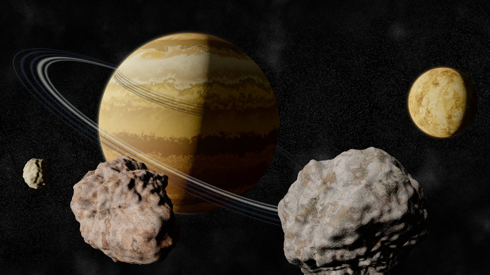
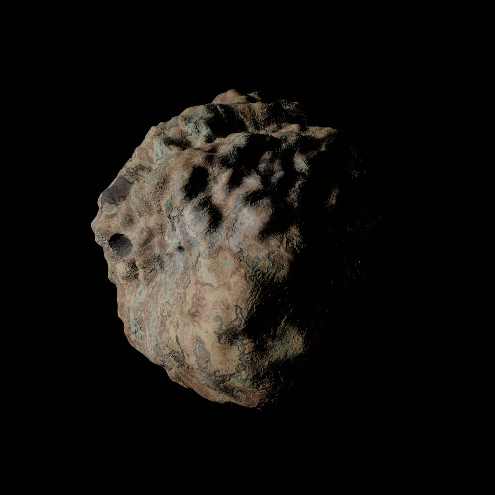
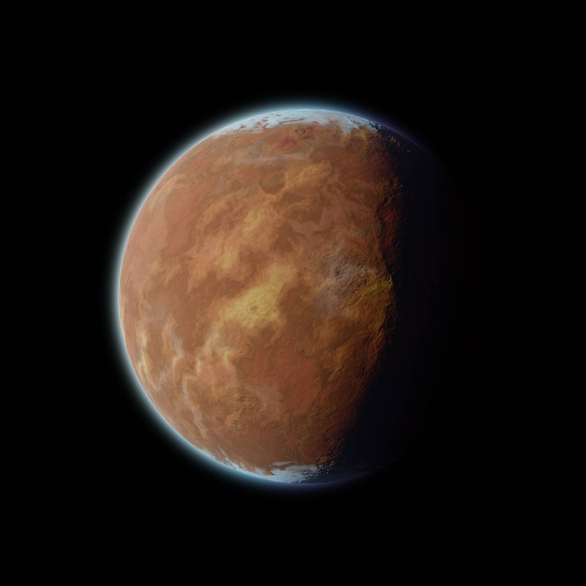
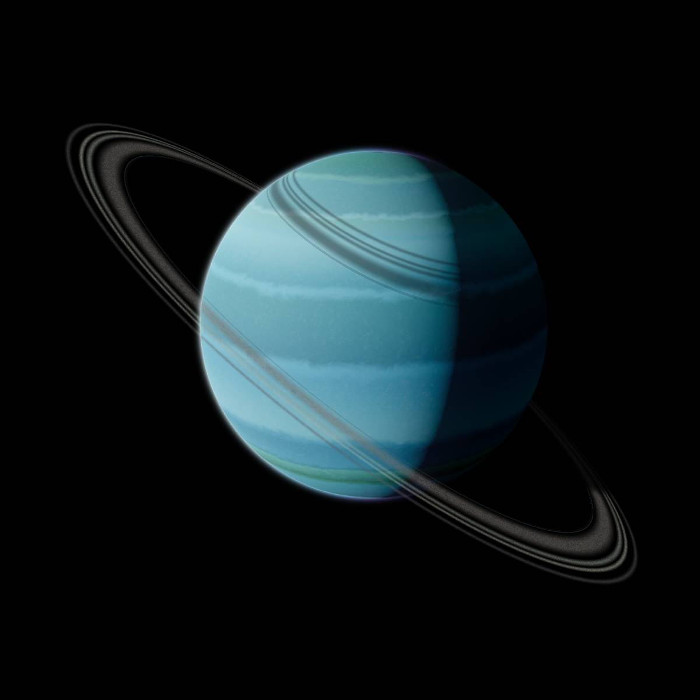
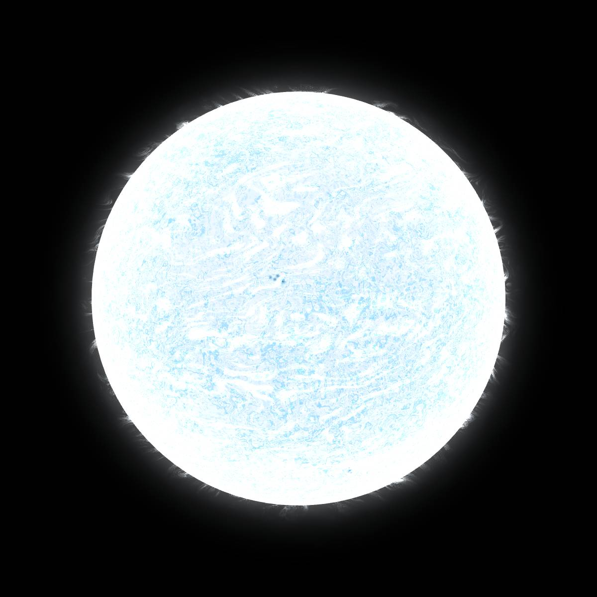
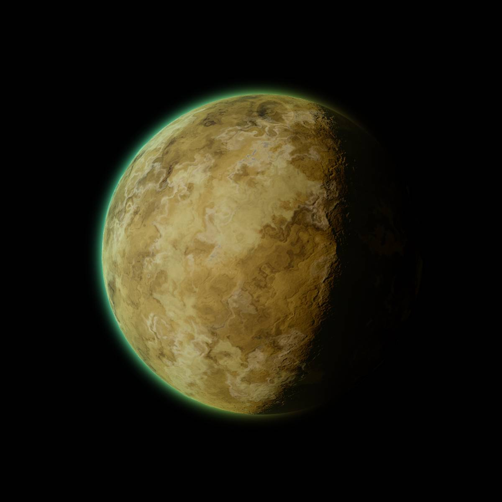

# Planetoid Generator



Single-page app for generating planetoid and asteroid artwork directly in the browser.

The app is built with Svelte + Vite and renders with THRELTE/Three.js. It generates procedural results and lets you export different render outputs, including texture and normal map imagery.

## Live demo

https://rdgreen.dev/planetoids/

## What this project does

- Interactive browser UI for procedural planetoid generation
- Tunable controls for color, geometry, craters, ridges, rifts, volcanoes, and material properties
- Optional polar ice caps with coverage, seeded edge breakup, editable palette stops, and tint controls
- Patchy snow fringes beyond the ice boundary, with snow extent and coverage controls
- Multiple view modes for output workflows (including texture and normal views)
- Presets and seed-based generation for repeatable results
- Scriptable batch generation using Playwright

## Requirements

- Node.js 18+
- npm

## Install

```bash
npm install
```

## Run the app (dev)

```bash
npm run dev
```

Open the planetoid page at:

- `http://127.0.0.1:5173/planetoids`

## Production build

```bash
npm run build
```

## Scripted auto-generation (Playwright)

This repo includes a Playwright-driven generator script that controls the SPA in a browser and captures output images.

### Run one batch directly

```bash
npm run auto-generate-planetoids -- --count 10 --seed 1 --step 1 --view-mode texture
```

Gas giant equivalent:

```bash
npm run auto-generate-gas-giants -- --count 10 --seed 1 --step 1 --palette jovianBands
```

Common options:

- `--view-mode mesh|normal|texture|ray`
- `--palette <name>`
- `--surface-tint <hex>`
- Planetoid ice caps: `--ice-caps-enabled true --ice-cap-coverage 0.18 --ice-cap-edge-noise 0.5 --ice-cap-palette glacial --ice-cap-color "#ffffff"`
- Snow fringe: add `--snow-extent 0.08 --snow-coverage 0.55` to an ice-cap batch; extent `0` disables snow
- `--output-dir <path>`
- `--base-url <url>` (defaults to `http://127.0.0.1:5173/planetoids`)

### Use the PowerShell batch helper

```powershell
./regenerate-planetoids.ps1
```

This helper runs multiple generation batches with different palette/settings profiles.

For gas giants:

```powershell
./regenerate-giants.ps1
```

This helper runs curated gas giant profiles and advances start seeds between each batch.

## Example outputs

Generated examples from `public/generated`:












## Notes

- Auto-generation expects the app to be reachable at the configured `--base-url`.
- Default output directory for the script is `public/generated/planetoid`.
