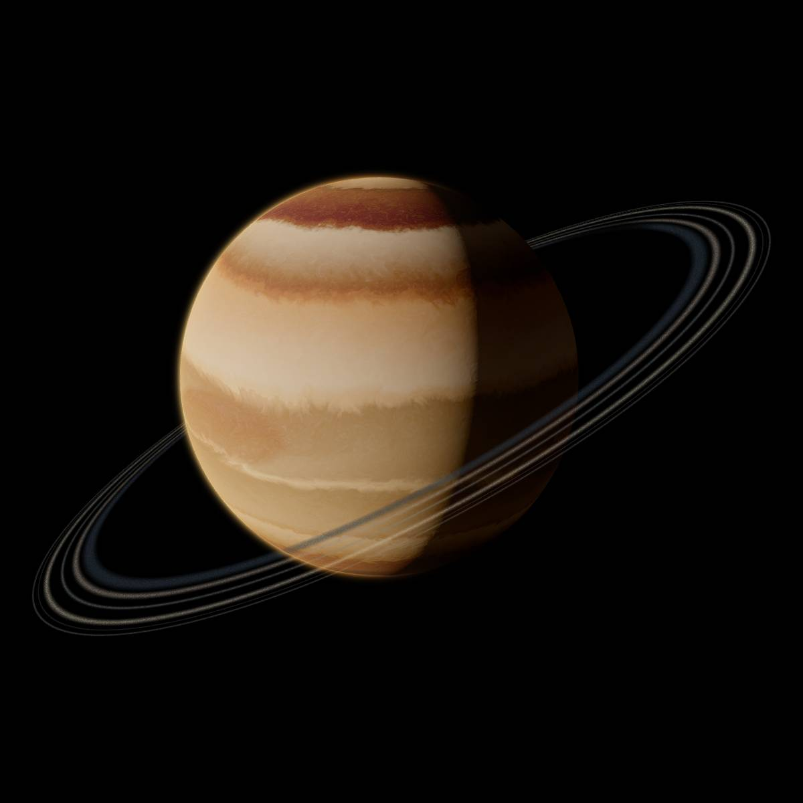

# Planetoid Generator


Single-page app for generating planetoid and asteroid artwork directly in the browser.

The app is built with Svelte + Vite and renders with THRELTE/Three.js. It generates procedural results and lets you export different render outputs, including texture and normal map imagery.

## Live demo

https://rdgreen.dev/planetoids/

## What this project does

- Interactive browser UI for procedural planetoid generation
- Tunable controls for color, geometry, craters, ridges, rifts, volcanoes, and material properties
- Optional polar ice caps with coverage, seeded edge breakup, editable palette stops, and tint controls
- Patchy snow fringes beyond the ice boundary, with snow extent and coverage controls
- Multiple view modes for output workflows (including texture and normal views)
- Presets and seed-based generation for repeatable results
- Gas giant (with rings) and star generators alongside planetoids
- Scriptable batch generation using Playwright, with CLI commands exportable from the UI

## Requirements

- Node.js 18+
- npm

## Install

```bash
npm install
```

## Run the app (dev)

```bash
npm run dev
```

Open the app at:

- `http://127.0.0.1:5173/` (pages: `#/planetoids`, `#/giants`, `#/stars`, `#/system`)

## Production build

```bash
npm run build
```

## Scripted auto-generation (Playwright)

Batch-generate planetoids, gas giants, and stars from the command line:

```bash
npm run auto-generate-planetoids -- --count 10 --seed 1
```

Any configuration you build in the UI can be exported as a ready-to-run command via
**Presets → Copy current as CLI command**. See [scripts/README.md](scripts/README.md) for all
options, camera controls, and examples.

## Example outputs

Generated examples from `public/examples`:





